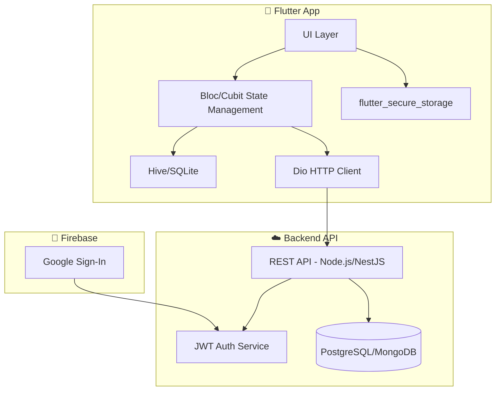

## 📱 Frontend (Flutter) - README-frontend.md

### 📦 Mô tả dự án

Ứng dụng Flutter giúp người dùng quản lý tài chính cá nhân. Cho phép đăng nhập bằng Google, tạo ví/tài khoản, ghi nhận thu chi, đặt ngân sách, theo dõi báo cáo. Hỗ trợ dùng offline (guest mode) và đồng bộ sau khi đăng nhập.

---

### 🚀 Công nghệ sử dụng

- Flutter 3.x
- Dio (API client)
- Firebase Auth (Google Sign-in)
- Bloc/Cubit (State management)
- Hive (dữ liệu offline, dữ liệu key value)
- Local Notification

---

### 📋 Yêu cầu hệ thống

- Flutter SDK 3.0.0 trở lên
- Dart 3.0.0 trở lên
- Android Studio / VS Code
- iOS Simulator (cho macOS) hoặc Android Emulator
- Node.js (cho backend development)

---

### 🔧 Cài đặt & Thiết lập

#### 1. Clone repository

```bash
git clone <repository-url>
cd Financy_app
```

#### 2. Cài đặt dependencies

```bash
flutter pub get
```

#### 3. Thiết lập Firebase

- Tạo project Firebase mới
- Thêm ứng dụng Android/iOS
- Tải `google-services.json` (Android) và `GoogleService-Info.plist` (iOS)
- Cấu hình Google Sign-In

#### 4. Cấu hình môi trường

Tạo file `.env` trong thư mục gốc:

```env
API_BASE_URL=http://localhost:3000
FIREBASE_PROJECT_ID=your-project-id
```

---

### 📁 Cấu trúc thư mục

```
lib/
├── main.dart                 # Entry point của ứng dụng
├── myApp.dart               # Cấu hình app chính
├── firebase_options.dart    # Cấu hình Firebase
├──
├── app/                     # Cấu hình ứng dụng
│   ├── cubit/              # App-level state management
│   ├── router/             # Định tuyến ứng dụng
│   ├── services/           # Dịch vụ chung
│   │   ├── Local/         # Local services (notifications, settings)
│   │   └── Server/        # Server services (Dio client, auth interceptor)
│   └── theme/             # Cấu hình theme
├──
├── core/                   # Core utilities
│   └── constants/         # Constants (colors, icons, language options)
├──
├── features/              # Các tính năng chính
│   ├── Account/          # Quản lý tài khoản/ví
│   │   ├── cubit/       # State management
│   │   ├── models/      # Data models
│   │   ├── repo/        # Repository layer
│   │   └── screen/      # UI screens
│   ├── auth/            # Xác thực người dùng
│   │   ├── cubits/      # Auth state management
│   │   ├── repository/  # Auth repository
│   │   └── views/       # Auth UI
│   ├── Categories/      # Quản lý danh mục
│   │   ├── cubit/       # Categories state management
│   │   ├── models/      # Category models
│   │   ├── repo/        # Categories repository
│   │   └── view/        # Categories UI
│   ├── notification/    # Thông báo
│   │   ├── cubit/       # Notification state
│   │   ├── models/      # Notification models
│   │   ├── repo/        # Notification repository
│   │   └── view/        # Notification UI
│   ├── transactions/    # Giao dịch thu chi
│   │   ├── Cubit/       # Transaction state management
│   │   ├── models/      # Transaction models
│   │   ├── repo/        # Transaction repository
│   │   └── view/        # Transaction UI
│   └── Users/           # Quản lý người dùng
│       ├── Cubit/       # User state management
│       ├── models/      # User models
│       ├── Repo/        # User repository
│       └── Views/       # User UI
├──
├── shared/               # Shared components
│   ├── utils/           # Utility functions
│   │   ├── color_utils.dart
│   │   ├── generateID.dart
│   │   ├── locale_utils.dart
│   │   ├── localText.dart
│   │   ├── mappingIcon.dart
│   │   ├── money_source_utils.dart
│   │   ├── statistics_utils.dart
│   │   └── theme_utils.dart
│   └── widgets/         # Shared widgets
├──
├── l10n/                # Internationalization
│   ├── app_en.arb       # English translations
│   ├── app_fr.arb       # French translations
│   ├── app_ja.arb       # Japanese translations
│   ├── app_ru.arb       # Russian translations
│   ├── app_vi.arb       # Vietnamese translations
│   └── l10n.dart        # Localization configuration
├──
├── income.dart          # Màn hình thu nhập
├── spending.dart        # Màn hình chi tiêu
├── statiscal.dart       # Màn hình thống kê
├── settings.dart        # Màn hình cài đặt
├── interfaceSettings.dart    # Cài đặt giao diện
├── languageSettings.dart     # Cài đặt ngôn ngữ
└── tran.txt            # File text giao dịch
```

---

### 🏗️ Kiến trúc hệ thống



### 🔐 Xác thực & token

- Đăng nhập bằng Google → lấy idToken → gửi backend → nhận accessToken
- accessToken được lưu bằng flutter_secure_storage
- Dio được cấu hình sẵn Authorization: Bearer token

Ví dụ:

```dart
void setToken(String? token) {
  if (token != null) {
    dio.options.headers['Authorization'] = 'Bearer $token';
  } else {
    dio.options.headers.remove('Authorization');
  }
}
```

---

### 📱 Chức năng đã có

- [x] Google Sign-in + JWT
- [x] Quản lý trạng thái auth (cubit)
- [x] CRUD Account (hiện tại là thủ công)
- [x] Giao diện account + chi tiết + xoá/sửa
- [x] Transaction list + add
- [x] Categories CRUD
- [x] Dashboard báo cáo
- [x] Offline mode (guest)
- [x] Local Notification
- [ ] Tự động sync khi login lại

---

### 📡 API endpoint config

lib/core/constants.dart:

```dart
const baseUrl = 'http://localhost:3000';
```

---

### ▶️ Chạy ứng dụng

#### Development

```bash
flutter pub get
flutter run
```

---

### ⏳ TODO tiếp theo

- [ ] Tự động refresh token
- [ ] Tích hợp ngân hàng sau
- [ ] Dashboard báo cáo nâng cao
- [ ] Export dữ liệu (PDF/Excel)
- [ ] Multi-language support
- [ ] Dark/Light theme toggle
- [ ] Push notifications
- [ ] Biometric authentication

---

### 📞 Liên hệ

- **Developer**: [Your Name]
- **Email**: [your.email@example.com]
- **GitHub**: [github.com/yourusername]

---

📌 Ghi chú:

- App hiện tại đang ở giai đoạn 1: CRUD + Auth
- Giai đoạn 2: thêm sync, ngân hàng, báo cáo nâng cao
