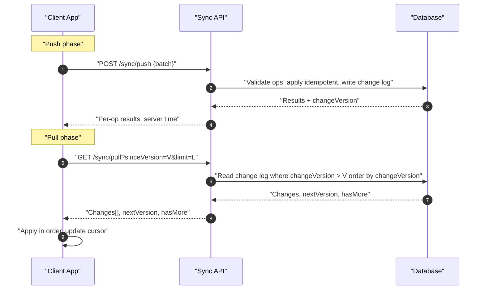
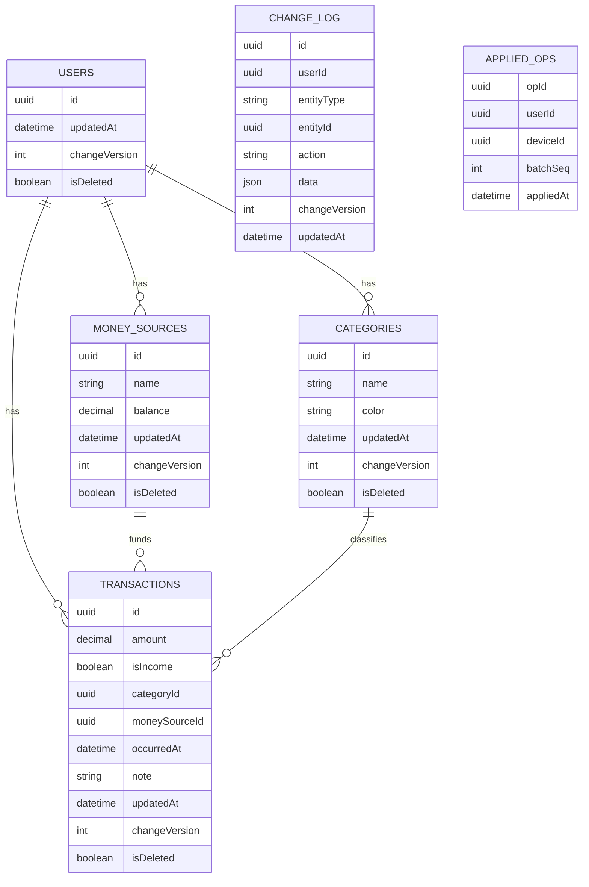

## Financy Sync Design

### Mục tiêu
- Đồng bộ hai chiều, ưu tiên offline-first.
- An toàn (idempotent), chịu lỗi mạng, tránh xung đột.
- Mở rộng cho các thực thể: `Users`, `MoneySources` (Accounts), `Transactions`, `Categories`, `Notifications`.

### Tổng quan kiến trúc
- Local Store (Hive/Sqflite) + bảng `outbox` ghi các thay đổi chưa đẩy lên server.
- Outbox pattern: mọi write → ghi local ngay (optimistic) + append vào `outbox`.
- Push/Pull theo lô; server gán `changeVersion` tăng dần và `updatedAt`.
- Soft delete qua `isDeleted`/`deletedAt`.
- Idempotency bằng `opId` (UUID), `deviceId`, `batchSeq` + bảng `applied_ops` trên server.
- Auth: JWT qua `Authorization` header (sử dụng `dio` + `auth_interceptor`).

### Trình tự đồng bộ


### Mô hình dữ liệu (ER rút gọn)


### API Contracts (Backend)

#### Handshake
- GET `/sync/handshake`
- Response:
```json
{
  "deviceId": "uuid-of-device",
  "serverTime": "2025-08-30T10:00:00Z",
  "latestVersion": 123456
}
```

#### Push (idempotent, theo lô)
- POST `/sync/push`
- Headers: `Idempotency-Key: <uuid>`
- Body:
```json
{
  "deviceId": "uuid-of-device",
  "batchSeq": 42,
  "operations": [
    {
      "opId": "uuid-1",
      "entityType": "transaction",
      "action": "upsert",
      "clientTempId": "uuid-temp-1",
      "entityId": "uuid-entity-1",
      "data": {
        "id": "uuid-entity-1",
        "amount": 120000,
        "isIncome": false,
        "categoryId": "uuid-cat-1",
        "moneySourceId": "uuid-src-1",
        "occurredAt": "2025-08-30T08:15:00Z",
        "note": "coffee"
      },
      "baseVersion": 123120
    }
  ]
}
```
- Response (per-op):
```json
{
  "results": [
    {
      "opId": "uuid-1",
      "status": "applied",
      "entityId": "uuid-entity-1",
      "serverAssignedId": null,
      "changeVersion": 123457,
      "updatedAt": "2025-08-30T10:00:01Z",
      "conflict": null
    }
  ],
  "serverTime": "2025-08-30T10:00:01Z"
}
```

#### Pull (delta theo cursor)
- GET `/sync/pull?sinceVersion=123120&limit=500`
- Response:
```json
{
  "changes": [
    {
      "entityType": "transaction",
      "entityId": "uuid-entity-1",
      "action": "upsert",
      "data": { /* full entity */ },
      "changeVersion": 123457,
      "updatedAt": "2025-08-30T10:00:01Z"
    }
  ],
  "nextVersion": 123457,
  "hasMore": false
}
```

### Luồng client (Flutter)
- Ghi (Create/Update/Delete):
  1) Ghi entity vào Local Store (optimistic UI).
  2) Ghi record vào `outbox`: `{opId, deviceId, seq, entityType, action, entityId/clientTempId, data, baseVersion}`.
  3) Lên lịch đồng bộ nền.

- Push:
  - Lấy N mục đầu từ `outbox` theo `seq` tăng dần và gửi.
  - Với kết quả:
    - `applied|duplicate`: xóa khỏi `outbox`, cập nhật `updatedAt`, `changeVersion`, map `serverAssignedId` nếu có.
    - `conflicted`: xử lý theo chiến lược bên dưới hoặc yêu cầu người dùng.
    - `failed` tạm thời: retry với exponential backoff + jitter.

- Pull:
  - Đọc `sinceVersion` từ `sync_meta`, gọi Pull lặp đến khi `hasMore=false`.
  - Áp dụng thay đổi theo thứ tự `changeVersion` tăng dần, cập nhật `sinceVersion`.

- Lịch chạy:
  - Khi app mở, sau mỗi write, khi offline→online, và định kỳ nền.
  - Android: `workmanager`/`android_alarm_manager_plus`; iOS: `background_fetch`.

### Chiến lược xung đột
- Mặc định: Last-Writer-Wins theo `changeVersion` (server authoritative).
- Theo thực thể:
  - Transactions: thường LWW; nếu khác biệt số lượng lớn có thể mở UI xác nhận.
  - Categories: có thể hợp nhất theo field; nếu trùng field → LWW.
  - MoneySources: tránh chỉnh trực tiếp `balance`; tính từ transactions.
- Nếu client gửi `baseVersion` < `currentVersion`: server trả `conflict` kèm `serverData`/hint.

### Bảo mật và quyền riêng tư
- TLS bắt buộc, JWT ở `Authorization` header.
- Mã hóa Local Store, khóa trong `flutter_secure_storage`.
- Ẩn PII trong logs; thêm `requestId` để trace.

### Giám sát & chỉ số
- Client: thời gian push/pull, batch size, outbox queue length, tỉ lệ lỗi.
- Server: QPS, độ trễ, 409/5xx, backlog change_log, kích cỡ delta trung bình.

### Kế hoạch triển khai
- Giai đoạn 1: Pull theo `sinceVersion` toàn cục, Push outbox idempotent, LWW, chưa realtime.
- Giai đoạn 2: Tối ưu batch, backoff, xử lý `conflict` có gợi ý hợp nhất.
- Giai đoạn 3: Realtime (WebSocket), cursors theo collection, đồng bộ nền ổn định.

### Gợi ý tích hợp với mã hiện có
- Tầng mạng: dùng `lib/app/services/Server/dio_client.dart` + `auth_interceptor.dart`.
- Tạo `SyncService`, `OutboxRepository`, `sync_meta` (per-collection hoặc toàn cục).
- Các `Repository` hiện tại ghi Local + append vào `outbox` thay vì gọi server trực tiếp.

### Test plan
- Unit: outbox ghi/đọc/sắp xếp, idempotency, soft delete, LWW.
- Integration: offline→online, xung đột, mất gói, batch lớn.
- Load test: `/sync/push`, `/sync/pull` với dữ liệu thực tế.

### Payload mẫu theo thực thể

#### Transactions
- Upsert (client → server, trong `operations[].data`):
```json
{
  "id": "a0f3d58f-6c34-4f21-9d8e-10f6e9c1c011",
  "amount": 120000,
  "isIncome": false,
  "categoryId": "b9c1a310-7436-4f01-93a3-b2a9f9f2af76",
  "moneySourceId": "0f4c94b5-8d72-4b20-9c6a-7f3b2c64ff3a",
  "occurredAt": "2025-08-30T08:15:00Z",
  "note": "Coffee",
  "tags": ["cafe"],
  "isDeleted": false
}
```
- Delete (client → server):
```json
{
  "id": "a0f3d58f-6c34-4f21-9d8e-10f6e9c1c011",
  "isDeleted": true
}
```
- Pull (server → client, trong `changes[].data`):
```json
{
  "id": "a0f3d58f-6c34-4f21-9d8e-10f6e9c1c011",
  "amount": 120000,
  "isIncome": false,
  "categoryId": "b9c1a310-7436-4f01-93a3-b2a9f9f2af76",
  "moneySourceId": "0f4c94b5-8d72-4b20-9c6a-7f3b2c64ff3a",
  "occurredAt": "2025-08-30T08:15:00Z",
  "note": "Coffee",
  "tags": ["cafe"],
  "isDeleted": false,
  "updatedAt": "2025-08-30T10:00:01Z",
  "changeVersion": 123457
}
```

#### MoneySources (Accounts)
- Upsert:
```json
{
  "id": "0f4c94b5-8d72-4b20-9c6a-7f3b2c64ff3a",
  "name": "Cash Wallet",
  "type": "cash",
  "balance": 2500000,
  "currency": "VND",
  "color": "#3B82F6",
  "icon": "wallet",
  "isDeleted": false
}
```
- Delete:
```json
{
  "id": "0f4c94b5-8d72-4b20-9c6a-7f3b2c64ff3a",
  "isDeleted": true
}
```
- Pull (server → client):
```json
{
  "id": "0f4c94b5-8d72-4b20-9c6a-7f3b2c64ff3a",
  "name": "Cash Wallet",
  "type": "cash",
  "balance": 2500000,
  "currency": "VND",
  "color": "#3B82F6",
  "icon": "wallet",
  "isDeleted": false,
  "updatedAt": "2025-08-30T10:00:00Z",
  "changeVersion": 123450
}
```

#### Categories
- Upsert:
```json
{
  "id": "b9c1a310-7436-4f01-93a3-b2a9f9f2af76",
  "name": "Food & Drinks",
  "color": "#F59E0B",
  "icon": "restaurant",
  "isDeleted": false
}
```
- Delete:
```json
{
  "id": "b9c1a310-7436-4f01-93a3-b2a9f9f2af76",
  "isDeleted": true
}
```
- Pull:
```json
{
  "id": "b9c1a310-7436-4f01-93a3-b2a9f9f2af76",
  "name": "Food & Drinks",
  "color": "#F59E0B",
  "icon": "restaurant",
  "isDeleted": false,
  "updatedAt": "2025-08-30T10:00:00Z",
  "changeVersion": 123440
}
```

#### Conflict response (ví dụ)
```json
{
  "opId": "uuid-1",
  "status": "conflicted",
  "entityId": "a0f3d58f-6c34-4f21-9d8e-10f6e9c1c011",
  "changeVersion": 123460,
  "updatedAt": "2025-08-30T10:02:10Z",
  "conflict": {
    "reason": "baseVersion_stale",
    "serverData": {
      "amount": 150000,
      "note": "Coffee + snack",
      "updatedAt": "2025-08-30T10:02:00Z",
      "changeVersion": 123459
    },
    "resolutionHint": "use_server_or_merge_fields"
  }
}
```

### Lược đồ local (client)

#### Outbox record
```json
{
  "seq": 1012,
  "opId": "b3d49f7a-6e24-4b2d-8b21-7f0e7f1e2a31",
  "deviceId": "0c7d7f20-1e8b-4a57-9ca1-0f6a3e4b2bda",
  "entityType": "transaction",
  "action": "upsert",
  "entityId": "a0f3d58f-6c34-4f21-9d8e-10f6e9c1c011",
  "clientTempId": null,
  "data": { /* payload như phần trên */ },
  "baseVersion": 123120,
  "createdAt": "2025-08-30T08:16:00Z"
}
```

#### Sync meta
```json
{
  "sinceVersion": 123456,
  "lastPulledAt": "2025-08-30T10:01:00Z",
  "lastPushedAt": "2025-08-30T10:00:58Z"
}
```

### Skeleton SyncService (tham khảo, không ràng buộc)

```dart
/// Trách nhiệm: điều phối push/pull, quản lý backoff, trạng thái và lỗi.
class SyncService {
  final DioClient dioClient;
  final OutboxRepository outboxRepo;
  final LocalStore localStore; // Sqflite/Hive gateway
  final SyncMetaRepository syncMetaRepo;
  final Connectivity connectivity;

  SyncService({
    required this.dioClient,
    required this.outboxRepo,
    required this.localStore,
    required this.syncMetaRepo,
    required this.connectivity,
  });

  Future<void> syncNow({bool force = false}) async {
    if (!await _hasNetwork()) return;
    await _pushOutboxBatches();
    await _pullDeltaLoop();
  }

  Future<void> scheduleBackgroundSync() async {
    // workmanager/background_fetch registration
  }

  Future<void> _pushOutboxBatches() async {
    // 1) paginate outbox by seq
    // 2) POST /sync/push với Idempotency-Key
    // 3) handle per-op results: applied/duplicate/conflicted/failed
    // 4) update local entities (updatedAt/changeVersion), clear outbox rows khi thành công
  }

  Future<void> _pullDeltaLoop({int pageSize = 500}) async {
    // while (hasMore) GET /sync/pull?sinceVersion=...
    // apply changes theo changeVersion tăng dần → localStore
    // update sinceVersion → syncMetaRepo
  }

  Future<bool> _hasNetwork() async {
    // dùng Connectivity check
    return true;
  }
}
```

#### Gợi ý thực thi
- Backoff: exponential (base 1s, max 60s) + jitter khi 5xx/timeout.
- Phân loại lỗi: 4xx (sai dữ liệu) → drop/sửa; 409 (conflict) → merge/hiển thị; 5xx → retry.
- Batch: tối đa 100 ops hoặc ~512KB để giữ ổn định mạng.
- Bảo toàn thứ tự: giữ `seq` theo thiết bị; không re-order trong cùng device.


